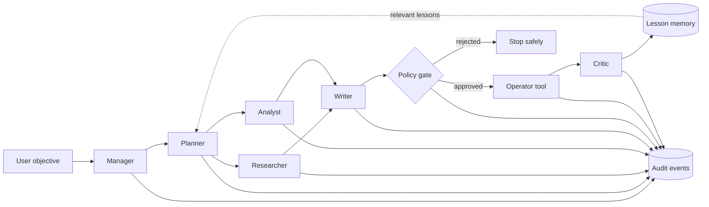

# AI Workforce

AI Workforce is a runnable capstone that demonstrates how a team of autonomous agents can research an objective, make a plan, execute tools, pause for human approval, and learn from the completed run. It ships with a REST API, CLI, browser operations console, SQLite audit log, and deterministic offline provider.

The central claim is intentionally narrow and testable: multi-agent automation becomes useful when delegation, tool access, approvals, observability, and learning are treated as one system—not when several chat prompts are merely chained together.

## Five-line deployment

```python
from ai_workforce import Workforce

team = Workforce()
run = team.delegate("Research an AI support pilot and send the sponsor a brief")
print(run.status, run.id)
```

External-facing actions pause for approval by default. The local demo writes approved messages to `data/outbox/`; it never sends real email.

## Quick start

Python 3.9+ is required.

```bash
python3 -m venv .venv
source .venv/bin/activate
pip install -e '.[dev]'
workforce demo
workforce serve
```

Open <http://127.0.0.1:8000>. API documentation is available at <http://127.0.0.1:8000/docs>.

## Proposal baseline: exact reproduction

No API key, network connection, input file, or environment variable is required for the baseline. From the repository root, run:

```bash
python3 -m venv .venv
source .venv/bin/activate
pip install -e .
workforce run "Analyze the AI support pilot evidence and prepare an action brief." --no-message
```

The concrete test specification is [`examples/proposal_baseline_case.json`](examples/proposal_baseline_case.json). The input is the `objective` in that file or the identical command-line string above. Structured output appears in the terminal as JSON and is persisted in `data/workforce.db`. The successful browser output captured for the proposal is [`artifacts/evidence/baseline-success.png`](artifacts/evidence/baseline-success.png), with a focused result view at [`artifacts/evidence/baseline-result.png`](artifacts/evidence/baseline-result.png).

Expected observable results:

- top-level `status` is `completed`;
- the research and synthesis steps are both `completed`;
- `result.review.quality_score` is `0.85` in deterministic demo mode;
- the evidence explicitly says no external sources were supplied;
- no message or other outbound side effect occurs because `--no-message` was used.

Typical setup and execution time on a laptop is under three minutes, with the actual baseline run completing in under one second after installation.

Docker is an alternative:

```bash
docker compose up --build
```

## What the demo proves

- **Specialization:** manager, planner, researcher, analyst, writer, operator, and critic roles have bounded responsibilities.
- **Real execution:** tools search supplied evidence, calculate metrics, synthesize a deliverable, and create an outbox artifact.
- **Human governance:** high-risk steps pause in `waiting_approval`; approval and rejection are durable events.
- **Observability:** plans, status transitions, tool outputs, timestamps, errors, and actor identities are stored in SQLite.
- **Learning:** the critic scores a completed run and writes a lesson to memory; related future objectives retrieve those lessons.
- **Reproducibility:** demo mode needs no network, account, model, or API key.

## Run with an LLM

Copy `.env.example` to `.env`, then set:

```dotenv
AI_WORKFORCE_PROVIDER=openai
OPENAI_API_KEY=your-key
AI_WORKFORCE_MODEL=gpt-4o-mini
```

The provider uses an OpenAI-compatible Chat Completions endpoint. Demo mode remains the recommended path for grading because it is deterministic.

## CLI examples

```bash
# Complete a run without an outbound action
workforce run "Analyze launch risks and prepare a recommendation" --no-message

# Exercise the approval flow from the CLI
workforce run "Draft and send the weekly status brief" --approve \
  --source "The pilot completed 91% of test cases"

workforce list
workforce metrics
workforce show run_abc123
```

## System flow



## Repository map

```text
src/ai_workforce/
  agents.py         specialized agent behaviors
  orchestrator.py   state machine, delegation, approval, recovery
  tools.py          bounded tool registry and simulated connector
  db.py             SQLite runs, steps, events, and memory
  llm.py            deterministic and OpenAI-compatible providers
  app.py            FastAPI application
  cli.py / sdk.py   CLI and embeddable facade
  static/           operations console
docs/               capstone plan, report, architecture, API, evaluation, safety
tests/              unit, workflow, and API tests
```

## Configuration

| Variable | Default | Purpose |
|---|---:|---|
| `AI_WORKFORCE_PROVIDER` | `demo` | `demo` or `openai` |
| `AI_WORKFORCE_MODEL` | `gpt-4o-mini` | Provider model name |
| `OPENAI_API_KEY` | empty | Required only for `openai` |
| `OPENAI_BASE_URL` | OpenAI API | Compatible endpoint base URL |
| `AI_WORKFORCE_DB` | `data/workforce.db` | SQLite path |
| `AI_WORKFORCE_OUTBOX` | `data/outbox` | Simulated connector artifact directory |
| `AI_WORKFORCE_AUTO_APPROVE` | `false` | Bypass gate; use only in controlled tests |
| `AI_WORKFORCE_HOST` | `127.0.0.1` | Server bind address |
| `AI_WORKFORCE_PORT` | `8000` | Server port |

## Verification

```bash
pytest --cov=ai_workforce
ruff check src tests
```

## Documentation

- [Capstone report](docs/CAPSTONE_REPORT.md)
- [Product requirements](docs/PRODUCT_REQUIREMENTS.md)
- [Project plan](docs/PROJECT_PLAN.md)
- [Architecture](docs/ARCHITECTURE.md)
- [API guide](docs/API.md)
- [Evaluation plan](docs/EVALUATION.md)
- [Safety, ethics, and threat model](docs/SAFETY_AND_ETHICS.md)
- [Demo script](docs/DEMO_SCRIPT.md)
- [Operations runbook](docs/OPERATIONS.md)
- [Requirements traceability](docs/TRACEABILITY.md)
- [Submission checklist](docs/SUBMISSION_CHECKLIST.md)

## Scope boundary

This project is a production-shaped educational prototype, not a production service. The included connector is deliberately simulated. A real deployment must add authenticated connector adapters, secret management, rate limiting, tenant isolation, durable job queues, model-level content controls, and organization-specific authorization policies.

## License

MIT — see [LICENSE](LICENSE).
