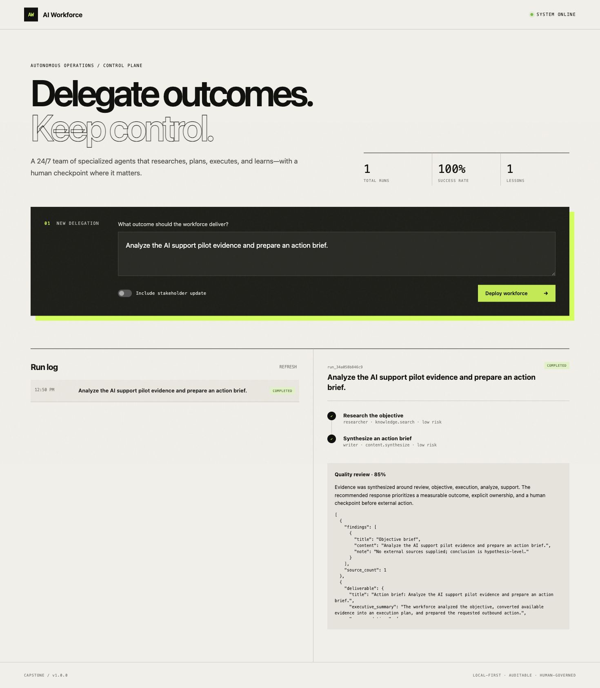
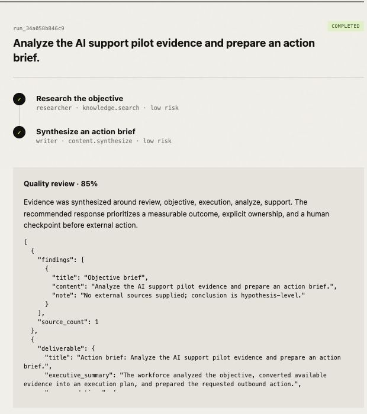
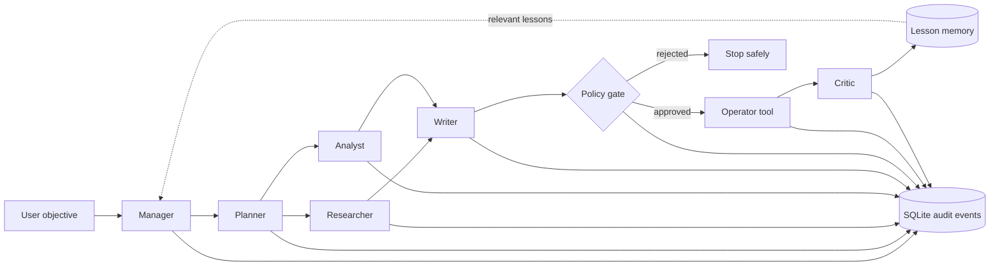
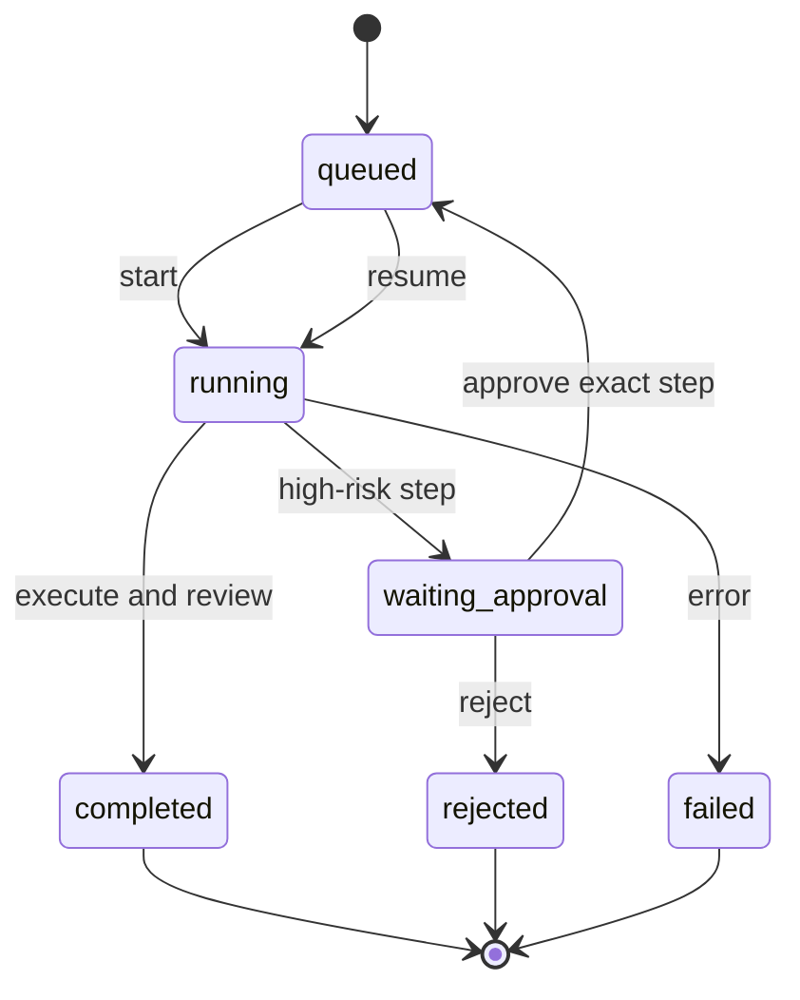

# AI Workforce

> A governed, observable multi-agent platform that researches an objective, creates a plan, executes bounded tools, pauses for human approval, and learns from completed runs.

[](https://www.python.org/)
[](https://fastapi.tiangolo.com/)
[](#testing-and-verification)
[](LICENSE)

AI Workforce is an individual CSE 598 capstone project and runnable baseline. It demonstrates that useful agent automation needs more than prompt chaining: it needs explicit delegation, bounded tool access, persistent state, human control, auditability, and a safe improvement loop.

The project runs locally in deterministic demo mode without an API key, paid service, account, or network connection.

## Table of contents

- [Problem and proposed solution](#problem-and-proposed-solution)
- [Current implementation](#current-implementation)
- [Baseline screenshots](#baseline-screenshots)
- [Quick start](#quick-start)
- [Concrete baseline test](#concrete-baseline-test)
- [Using the dashboard](#using-the-dashboard)
- [Architecture](#architecture)
- [Agents and tools](#agents-and-tools)
- [Configuration](#configuration)
- [API and CLI](#api-and-cli)
- [Testing and verification](#testing-and-verification)
- [Evaluation plan](#evaluation-plan)
- [Future plans](#future-plans)
- [Safety and limitations](#safety-and-limitations)
- [Project structure and documentation](#project-structure-and-documentation)
- [Troubleshooting](#troubleshooting)

## Problem and proposed solution

Many AI agents can generate a plan or useful text but cannot safely complete work across multiple steps. Important operational questions remain unanswered:

- Which agent or tool performed each action?
- What happens if execution stops halfway through?
- Can a model trigger an external action without authorization?
- Can the system reuse lessons without silently changing its safety policy?
- Can another person reproduce and evaluate the result?

AI Workforce addresses these problems with a stateful manager-worker architecture. A manager receives the objective, a planner produces typed steps, specialized workers execute only registered tools, high-risk steps require human approval, and a critic stores a scored lesson after successful completion.

### Operational definition of success

A run succeeds when it completes the intended workflow, every step and output is stored, the result is inspectable, and no high-risk tool executes before approval. A run fails when a tool or provider raises an error, a plan references an invalid tool, output is missing, or an action occurs outside its recorded authorization.

## Current implementation

| Capability | Status | Evidence |
|---|---|---|
| Natural-language objective intake | Implemented | UI, CLI, SDK, and REST API |
| Manager and specialized worker roles | Implemented | Persisted plan actors and event trace |
| Research-to-action workflow | Implemented | Knowledge, calculation, synthesis, and messaging tools |
| Human approval and rejection | Implemented | Durable `waiting_approval` state and tests |
| Persistent audit history | Implemented | SQLite runs, steps, outputs, events, and timestamps |
| Bounded cross-run learning | Implemented | Critic score and sourced lesson memory |
| Offline deterministic execution | Implemented | Default `demo` provider |
| OpenAI-compatible model provider | Implemented | Optional environment configuration |
| Real external application delivery | Planned | Current message connector uses a simulated local outbox |
| Dynamic model-generated planning | Planned | Baseline planner is intentionally constrained |

## Baseline screenshots

### Successful end-to-end dashboard run

The following screenshot was captured from the running local application on September 6, 2026. It shows the submitted objective, `completed` status, two completed agent steps, a saved lesson, and a deterministic quality score of 85%.



### Focused result and agent trace



The screenshots are also available as standalone submission artifacts:

- [`artifacts/evidence/baseline-success.png`](artifacts/evidence/baseline-success.png)
- [`artifacts/evidence/baseline-result.png`](artifacts/evidence/baseline-result.png)

## Quick start

### Requirements

- Python 3.9 or newer
- `pip`
- A terminal
- Approximately three minutes for first-time setup

No API key or environment variable is required for the default baseline.

### Install and run the baseline

```bash
git clone YOUR_PUBLIC_REPOSITORY_URL
cd ai-workforce-capstone
python3 -m venv .venv
source .venv/bin/activate
pip install -e .
workforce run "Analyze the AI support pilot evidence and prepare an action brief." --no-message
```

Windows PowerShell users should activate the environment with:

```powershell
.venv\Scripts\Activate.ps1
```

### Start the web application

```bash
workforce serve
```

Then open:

- Dashboard: <http://127.0.0.1:8000>
- Interactive API documentation: <http://127.0.0.1:8000/docs>
- Health check: <http://127.0.0.1:8000/health>

### Docker alternative

```bash
docker compose up --build
```

Open <http://127.0.0.1:8000> after the container starts.

## Concrete baseline test

The complete test specification is stored in [`examples/proposal_baseline_case.json`](examples/proposal_baseline_case.json).

### Input

```text
Analyze the AI support pilot evidence and prepare an action brief.
```

### Exact command

```bash
workforce run "Analyze the AI support pilot evidence and prepare an action brief." --no-message
```

### Expected behavior

- The run reaches `completed`.
- `Research the objective` reaches `completed`.
- `Synthesize an action brief` reaches `completed`.
- The deterministic quality score is `0.85`.
- The result discloses that no external sources were supplied.
- No message or other outbound side effect occurs.

### Actual observed output

The verified run produced these key fields:

```json
{
  "status": "completed",
  "plan": [
    {
      "title": "Research the objective",
      "agent": "researcher",
      "tool": "knowledge.search",
      "status": "completed"
    },
    {
      "title": "Synthesize an action brief",
      "agent": "writer",
      "tool": "content.synthesize",
      "status": "completed"
    }
  ],
  "result": {
    "review": {
      "quality_score": 0.85,
      "checks": {
        "has_evidence": true,
        "all_steps_completed": true,
        "external_action_guarded": true
      }
    }
  },
  "error": null
}
```

The full JSON is printed to the terminal and persisted in `data/workforce.db`. Generated database and outbox files are ignored by Git.

## Using the dashboard

1. Run `workforce serve`.
2. Enter an outcome in **New Delegation**.
3. Disable **Include stakeholder update** for an automatic no-side-effect run.
4. Leave it enabled to exercise the approval workflow.
5. Select the run in **Run log** to inspect agents, tools, statuses, and outputs.
6. If the run reaches `waiting approval`, approve or reject the exact high-risk step.
7. Review the final artifacts, quality checks, and updated lesson metric.

Approved messages are written as JSON files under `data/outbox/`. Delivery is explicitly labeled `simulated`; the project never sends real email.

## Five-line SDK example

```python
from ai_workforce import Workforce

team = Workforce()
run = team.delegate("Research an AI support pilot and prepare a brief", send_message=False)
print(run.status.value, run.result["review"]["quality_score"])
```

## Architecture



### Run lifecycle



The model/provider never receives direct application authority. The orchestrator selects a registered tool and checks its risk before invocation.

## Agents and tools

### Agent organization

| Role | Responsibility | Direct external authority |
|---|---|---|
| Manager | Owns the objective and delegation strategy | No |
| Planner | Converts an objective into ordered typed steps | No |
| Researcher | Collects supplied evidence and provenance | No |
| Analyst | Calculates requested metrics safely | No |
| Writer | Produces the structured action brief | No |
| Operator | Invokes an approved application tool | Approval required |
| Critic | Scores the completed run and saves a lesson | Memory write only |

### Registered tools

| Tool | Function | Side effect | Risk |
|---|---|---|---|
| `knowledge.search` | Searches supplied context and prior work | None | Low |
| `data.calculate` | Evaluates an allowlisted arithmetic AST | None | Low |
| `content.synthesize` | Creates a structured brief | None | Low |
| `app.message` | Writes a simulated email/Slack/task message | Local outbox file | High |

## Configuration

Copy `.env.example` to `.env` only when overriding defaults.

| Variable | Default | Purpose |
|---|---:|---|
| `AI_WORKFORCE_PROVIDER` | `demo` | Select `demo` or `openai` |
| `AI_WORKFORCE_MODEL` | `gpt-4o-mini` | Compatible model name |
| `OPENAI_API_KEY` | empty | Required only for the `openai` provider |
| `OPENAI_BASE_URL` | OpenAI API | OpenAI-compatible endpoint base URL |
| `AI_WORKFORCE_DB` | `data/workforce.db` | SQLite database location |
| `AI_WORKFORCE_OUTBOX` | `data/outbox` | Simulated connector output directory |
| `AI_WORKFORCE_AUTO_APPROVE` | `false` | Test-only approval bypass; keep false normally |
| `AI_WORKFORCE_HOST` | `127.0.0.1` | Server bind address |
| `AI_WORKFORCE_PORT` | `8000` | Server port |

### Optional live model

```dotenv
AI_WORKFORCE_PROVIDER=openai
OPENAI_API_KEY=your-key
AI_WORKFORCE_MODEL=gpt-4o-mini
```

Demo mode remains the recommended grading configuration because its behavior is deterministic and free of external dependencies.

## API and CLI

### Main API routes

| Method | Endpoint | Purpose |
|---|---|---|
| `GET` | `/health` | Service health and version |
| `POST` | `/api/runs` | Create and optionally start a run |
| `GET` | `/api/runs` | List recent runs |
| `GET` | `/api/runs/{id}` | Inspect one run and its event trace |
| `POST` | `/api/runs/{id}/start` | Start a queued run |
| `POST` | `/api/runs/{id}/approval` | Approve or reject one waiting step |
| `GET` | `/api/tools` | Inspect registered tools and risk levels |
| `GET` | `/api/metrics` | View completion, failure, approval, and lesson metrics |

### CLI examples

```bash
# Reproducible no-message baseline
workforce run "Analyze launch risks and prepare a recommendation" --no-message

# Supply evidence and exercise approval automatically from the CLI
workforce run "Draft and send the weekly status brief" --approve \
  --source "The pilot completed 91% of test cases"

# Run the complete scripted demonstration
workforce demo

# Inspect durable state
workforce list
workforce metrics
workforce show RUN_ID
```

## Testing and verification

Install development dependencies and run:

```bash
pip install -e '.[dev]'
ruff check src tests
pytest --cov=ai_workforce --cov-report=term-missing
```

Current verified result on Python 3.9.6:

```text
All checks passed!
............                                                     [100%]
12 passed
TOTAL test coverage: 78%
Orchestrator coverage: 94%
```

The test suite covers:

- successful research and synthesis;
- no side effect before approval;
- approval and exactly-once terminal execution;
- terminal rejection with no outbox artifact;
- malicious calculator expressions;
- SQLite persistence and metrics;
- cross-run lesson reuse;
- API lifecycle and request validation.

## Evaluation plan

The future improved system will be compared with this baseline on 20 fixed objectives.

| Metric | Definition | Target |
|---|---|---:|
| Task success | Completed valid runs / attempts | At least 90% in demo mode |
| Unauthorized actions | High-risk calls before approval | 0 |
| Trace completeness | Expected lifecycle events present | 100% |
| Evidence coverage | Research runs with provenance | 100% |
| Memory reuse | Related second runs receiving a prior lesson | 100% |
| Local baseline latency | Median deterministic no-message run | Under 2 seconds |

Three human reviewers will also score relevance, factuality, recommendation feasibility, appropriate approval, and trace clarity from 1–5. Results will report medians, variability, and failure cases instead of presenting the built-in structural score as factual accuracy.

## Future plans

The baseline deliberately proves the workflow and governance contracts before adding broader autonomy.

### Phase 1 — Source-grounded research

- Add web and document research connectors with source-level citations.
- Isolate external content so prompt injection cannot alter policy or tool authority.
- Add evidence-quality and contradiction checks.
- Evaluate factuality against a fixed answer set.

### Phase 2 — Constrained dynamic planning

- Let a model select and order steps from typed tool schemas.
- Validate every generated plan before execution.
- Add task, time, token, and cost budgets.
- Support recovery and replanning after safe, non-side-effect failures.

### Phase 3 — Stronger memory and self-improvement

- Replace lexical retrieval with semantic search.
- Add lesson provenance, expiration, conflict detection, review, and deletion.
- Compare runs with and without memory under equal model budgets.
- Keep safety policies and source code outside the self-improvement loop.

### Phase 4 — Real application integrations

- Add one authenticated connector, initially Slack, email, or a task system.
- Enforce least-privilege scopes and destination allowlists.
- Add idempotency keys, retries, rate limits, and a transactional outbox.
- Bind approvals to authenticated actors, exact payload previews, and expiration times.

### Phase 5 — Production-oriented control plane

- Replace in-process work with durable queued workers.
- Migrate SQLite to PostgreSQL with concurrency controls.
- Add tenant isolation, role-based access, encrypted secrets, and audit retention.
- Add OpenTelemetry traces, operational alerts, model-cost dashboards, and incident controls.

### Semester milestone sequence

| Milestone | Outcome |
|---|---|
| M1 — Baseline | Reproducible research-to-brief workflow — complete |
| M2 — Governed action | Human approval prevents unauthorized execution — complete |
| M3 — Source grounding | Research connectors and citation evaluation |
| M4 — Dynamic planning | Validated model-generated plans with budgets |
| M5 — Improved memory | Semantic, reviewable lessons with ablation evaluation |
| M6 — Final evaluation | Baseline comparison, human rubric, and failure analysis |

## Safety and limitations

### Current safety controls

- Registered-tool allowlist
- Explicit low/high risk classification
- Default-deny human approval for high-risk steps
- Step- and run-bound approval decisions
- Terminal rejection that cannot be silently routed around
- Restricted AST calculator instead of arbitrary code execution
- Durable event and output trace
- Simulated connector instead of real message delivery

### Known limitations

- The baseline planner follows a fixed research-to-action pattern.
- Demo-mode synthesis is deterministic and does not establish live-model quality.
- Missing sources are disclosed, but the baseline does not retrieve sources itself.
- Memory retrieval is lexical and may miss semantically related objectives.
- The quality score measures workflow structure, not factual accuracy.
- SQLite and in-process background execution are single-node choices.
- The local API has no authentication and must not be exposed to the internet.
- The connector creates inspectable local artifacts but does not test real delivery failures.

This is a production-shaped educational prototype, not a production service and not a system for high-impact hiring, lending, healthcare, admissions, benefits, or legal decisions.

## Project structure and documentation

```text
src/ai_workforce/
  agents.py         specialized agent behaviors
  orchestrator.py   state machine, delegation, approval, and recovery
  tools.py          bounded tools and simulated connector
  db.py             SQLite runs, steps, events, and memory
  llm.py            deterministic and OpenAI-compatible providers
  app.py            FastAPI application
  cli.py / sdk.py   command line and Python facade
  static/           browser operations console
tests/              unit, workflow, security-negative, and API tests
examples/           five-line example and reproducible test inputs
artifacts/          completed proposal and actual run screenshots
docs/               requirements, design, evaluation, safety, and operations
```

Detailed documents:

- [Completed capstone proposal](artifacts/CSE598-Capstone-Proposal-Manas-Arun-Tole.docx)
- [Capstone report](docs/CAPSTONE_REPORT.md)
- [Product requirements](docs/PRODUCT_REQUIREMENTS.md)
- [Project plan](docs/PROJECT_PLAN.md)
- [Architecture](docs/ARCHITECTURE.md)
- [API guide](docs/API.md)
- [Evaluation plan](docs/EVALUATION.md)
- [Safety, ethics, and threat model](docs/SAFETY_AND_ETHICS.md)
- [Operations runbook](docs/OPERATIONS.md)
- [Demo script](docs/DEMO_SCRIPT.md)
- [Requirements traceability](docs/TRACEABILITY.md)
- [Submission checklist](docs/SUBMISSION_CHECKLIST.md)

## Troubleshooting

| Problem | Resolution |
|---|---|
| `workforce: command not found` | Activate `.venv` and rerun `pip install -e .` |
| Port 8000 is already in use | Run `workforce serve --port 8010` |
| `OPENAI_API_KEY` error | Set `AI_WORKFORCE_PROVIDER=demo` or provide a valid key |
| Run remains at `waiting_approval` | Approve or reject the highlighted step in the dashboard |
| No outbox file appears | Confirm messaging was enabled and the action was approved |
| SQLite reports a lock | Stop duplicate server processes; production should use PostgreSQL |

## Repository and Canvas submission

Before submission:

1. Push this repository to a **public** GitHub repository.
2. Replace `YOUR_PUBLIC_REPOSITORY_URL` above with the actual clone URL.
3. Replace the repository placeholder in the proposal DOCX.
4. Open the public repository in a private/incognito browser window to confirm anonymous access.
5. Submit the proposal DOCX and successful-run screenshot to Canvas.

## License

MIT — see [LICENSE](LICENSE).
