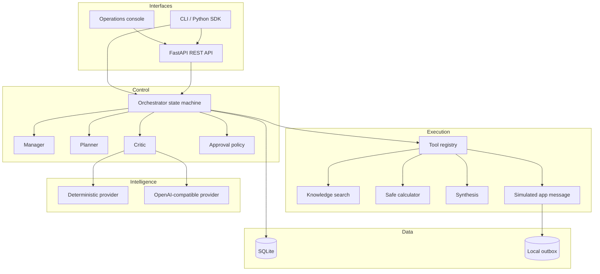
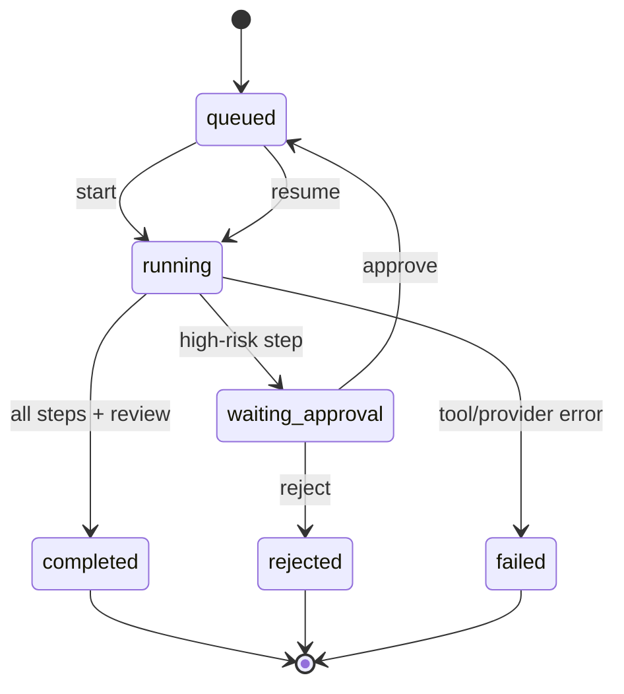

# Architecture

## Design goals

The architecture favors explicit state and small trust boundaries. “Agent” describes a bounded role in a workflow; it does not imply unlimited authority, recursive spawning, or unrestricted tool access.

## Components

## Run state machine

Terminal runs are immutable through the public orchestration flow. Completed steps are skipped on resume, which provides basic at-most-once behavior inside one process. Connector-level idempotency keys are required before real integrations are introduced.

## Data model

| Table | Purpose | Notable fields |
|---|---|---|
| `runs` | Objective and top-level lifecycle | status, context, result, error, timestamps |
| `steps` | Ordered execution plan | agent, tool, risk, status, output |
| `events` | Append-only operational trace | event type, actor, JSON payload, timestamp |
| `memories` | Cross-run lessons | objective key, lesson, quality score, source run |

SQLite is adequate for a single-node evaluator. A production evolution would use PostgreSQL for state, a queue such as Redis/SQS for workers, and object storage for large artifacts.

## Agent contracts

- **Manager:** owns the objective and delegation strategy; cannot call application tools directly.
- **Planner:** maps an objective to typed steps using only registered tools.
- **Researcher/analyst/writer/operator:** execution identities recorded on each step.
- **Critic:** evaluates only after execution and can write lesson memory, not alter the completed result.

## Tool contract

Each tool has a unique name, description, declared risk, one structured input context, and JSON-serializable output. A tool cannot choose its own authority. The orchestrator evaluates risk before invocation.

Current tools:

| Tool | Side effect | Risk |
|---|---|---|
| `knowledge.search` | None | Low |
| `data.calculate` | None; safe AST subset | Low |
| `content.synthesize` | None | Low |
| `app.message` | Writes a local outbox artifact | High |

## Self-improvement loop

“Self-improving” is implemented as bounded episodic memory:

1. Critic calculates a transparent quality score.
2. Critic records a lesson with its source run and objective keywords.
3. A later related objective retrieves top-scoring lessons.
4. Manager includes them in delegation context.

This approach is reversible and auditable. It avoids autonomous prompt/code changes, reward hacking, and silent policy drift.

## Failure handling

Exceptions become a durable `failed` run with a sanitized type/message and `run.failed` event. Completed steps remain persisted. The caller can inspect the trace. Automated retries are excluded from MVP because a safe retry policy depends on connector idempotency and error classification.

## Scaling path

1. Replace in-process background tasks with a durable queue and leased workers.
2. Migrate SQLite to PostgreSQL with optimistic concurrency/version columns.
3. Add OIDC, tenant IDs, RBAC, encrypted secrets, and per-tool scopes.
4. Implement connector idempotency, retries, rate limits, and dead-letter queues.
5. Add OpenTelemetry traces, cost/token budgets, evaluation sampling, and alerts.

